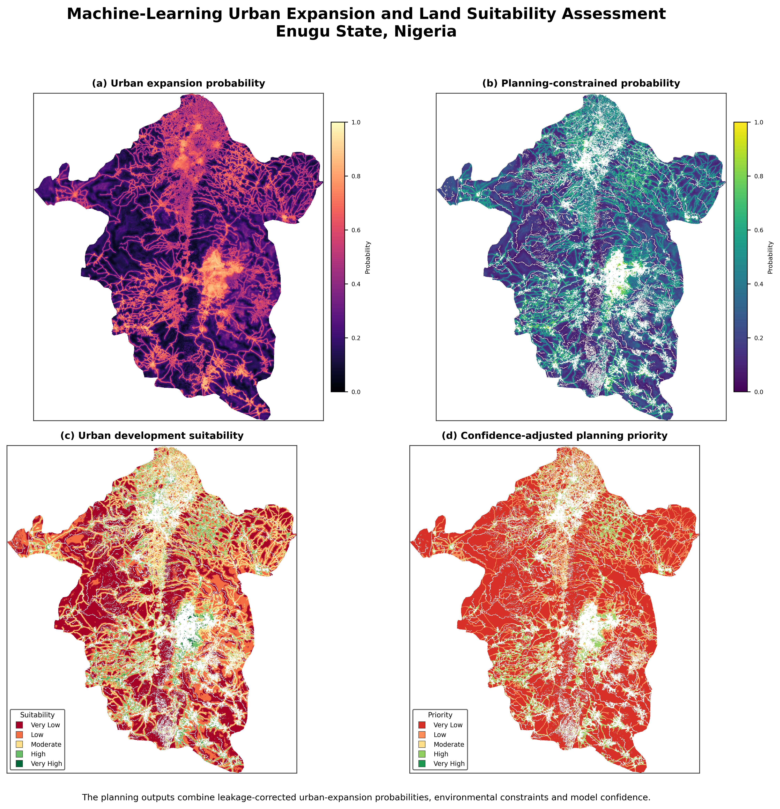
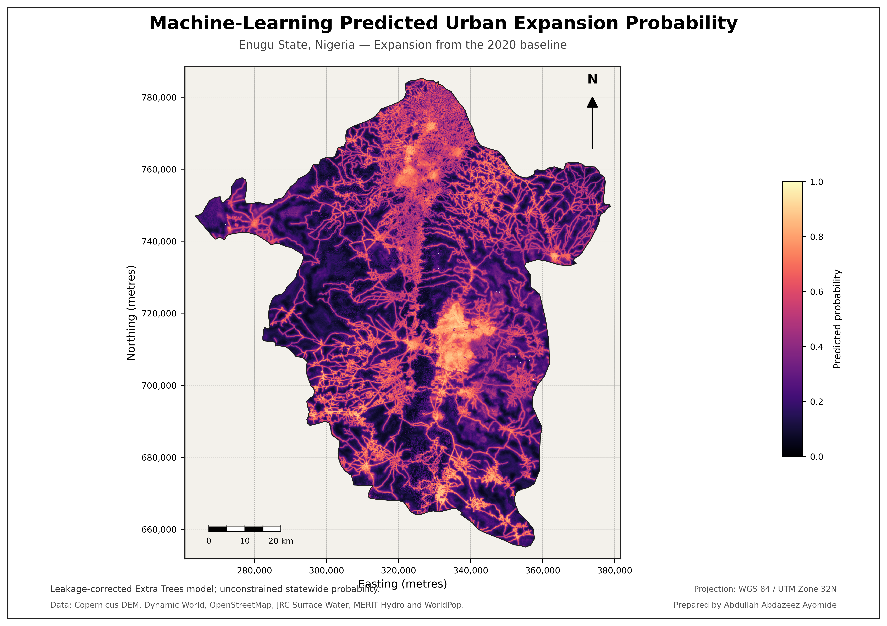
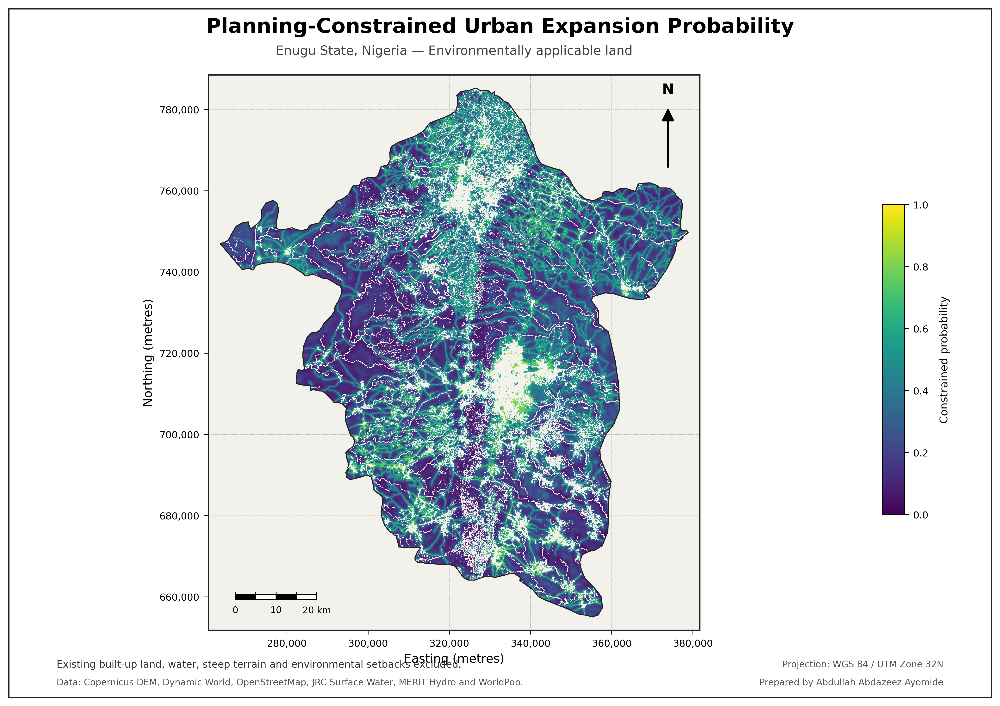
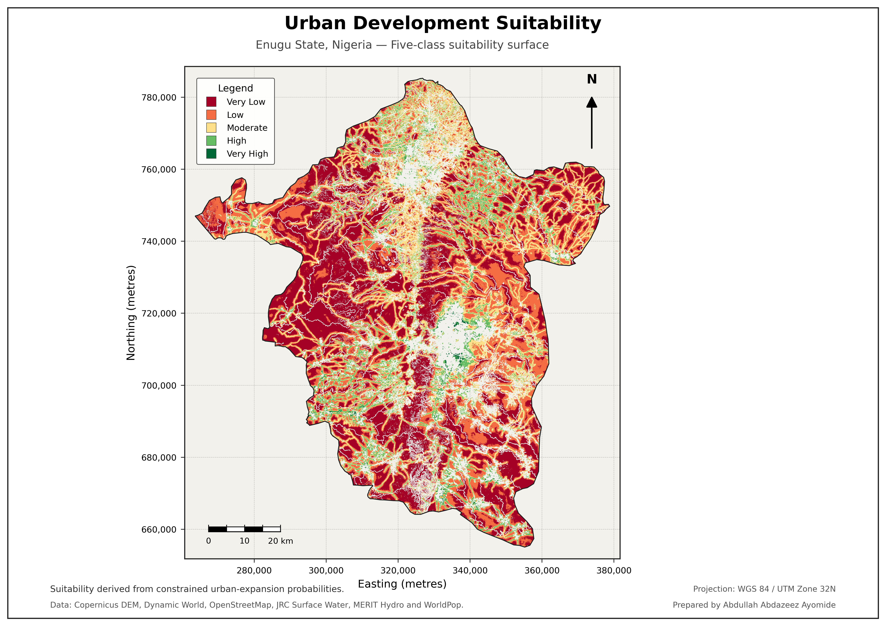
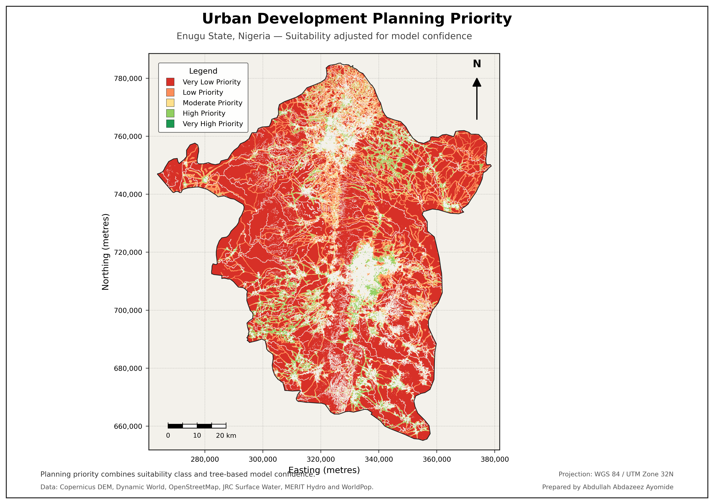
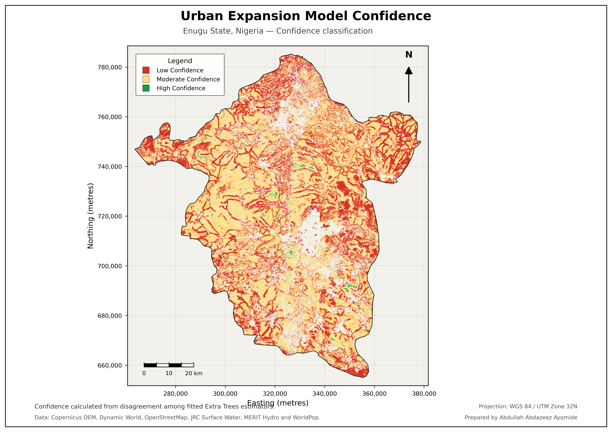
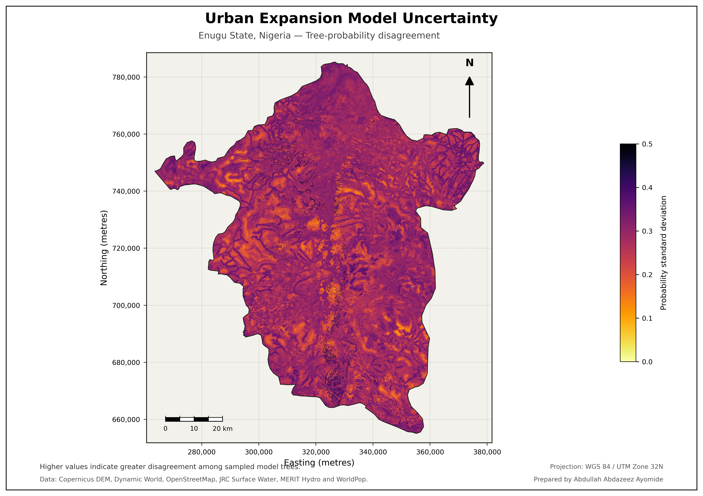

# Machine-Learning-Based Land Suitability Analysis — Enugu State, Nigeria

**A reproducible Extra Trees modelling workflow that integrates urban-expansion evidence, terrain, accessibility, environmental conditions and planning constraints to identify land suitable for sustainable urban development.**

<p align="center">
  
</p>

Urban growth decisions require more than identifying undeveloped land. Suitable locations must balance development potential with terrain, accessibility, environmental sensitivity, existing settlement patterns and model reliability. This project developed a statewide machine-learning workflow for Enugu State using multi-source geospatial predictors and spatially separated training, validation and independent test samples.

An **Extra Trees classifier** was selected after candidate-model assessment and evaluated on an independent spatial test set containing **3,600 samples across 32 spatial blocks**. The final model achieved a **ROC-AUC of 0.7517**, **balanced accuracy of 0.7111**, **F1 score of 0.7324** and **Cohen Kappa of 0.4222**. These results indicate useful but imperfect discrimination, so the outputs are presented as planning-support evidence rather than deterministic development approvals.

After applying environmental and planning constraints, approximately **6,050.85 km²** remained within the model-applicable planning area, while **1,568.63 km²** was constrained. High and very-high suitability accounted for **515.09 km²** and **16.67 km²** respectively. The final planning-priority surface identified **392.83 km²** as high priority and **0.37 km²** as very-high priority. Only **30.08 km²** qualified as high-confidence suitable land, highlighting the importance of interpreting suitability together with confidence and uncertainty.

| Project detail | Information |
|---|---|
| **Study area** | Enugu State, Nigeria |
| **Analysis year** | 2025 |
| **Selected model** | Extra Trees classifier |
| **Independent test set** | 3,600 samples across 32 spatial blocks |
| **ROC-AUC** | 0.7517 |
| **Balanced accuracy** | 0.7111 |
| **F1 score** | 0.7324 |
| **Primary outputs** | Probability, constrained probability, suitability, priority, confidence and uncertainty |

## Key findings

- Independent test **ROC-AUC:** **0.7517**
- Independent test **balanced accuracy:** **0.7111**
- Independent test **F1 score:** **0.7324**
- Independent test **Cohen Kappa:** **0.4222**
- Planning-applicable area: **6,050.85 km²**
- Planning-constrained area: **1,568.63 km²**
- High-suitability land: **515.09 km²**
- Very-high-suitability land: **16.67 km²**
- High planning-priority land: **392.83 km²**
- Very-high planning-priority land: **0.37 km²**
- High-confidence suitable land: **30.08 km²**
- Mean statewide expansion probability: **0.3500**
- Mean planning-constrained probability: **0.3137**

## Analytical workflow

1. Prepared Enugu State and LGA boundaries.
2. Generated elevation and slope from Copernicus DEM.
3. Processed Dynamic World and Sentinel-2 land-cover and spectral predictors.
4. Derived road-accessibility, population, settlement and environmental indicators.
5. Generated planning constraints and model-applicability masks.
6. Constructed spatially separated training, validation and independent test samples.
7. Compared candidate machine-learning models and selected Extra Trees.
8. Assessed discrimination, class performance, calibration and feature importance.
9. Predicted statewide urban-expansion probability.
10. Derived confidence and uncertainty surfaces.
11. Applied planning constraints and classified development suitability.
12. Combined suitability and planning evidence into priority classes.
13. Validated outputs and produced final cartographic and portfolio deliverables.

## Selected outputs

### Urban-expansion probability



### Planning-constrained probability



### Urban-development suitability



### Planning priority



### Model confidence



### Model uncertainty



## Reproducibility

The complete staged Colab notebook is included:

```text
notebooks/Project_7_Enugu_ML_Land_Suitability_Reproducible.ipynb
```

The cleaned notebook preserves the final corrected production workflow. The original development notebook is retained separately for provenance. A full rerun requires Google Earth Engine authentication, Google Drive access and the external data sources documented in the notebook and methodology.

The browser-upload repository includes the final categorical GIS rasters, all final maps, the complete cleaned notebook and the statistical tables used to verify the published results. Continuous probability, confidence and uncertainty rasters are documented and reproducible from the notebook but are omitted from the browser package to keep the repository lightweight.

```bash
pip install -r requirements.txt
python scripts/python/reproduce_summary.py
python validation/validate_repository.py
```

## Planning interpretation

The final outputs should be used as a screening and decision-support system. High suitability does not replace detailed site investigation, land-tenure review, infrastructure-capacity assessment, environmental impact assessment or community consultation.

The relatively limited high-confidence suitable area demonstrates why probability alone should not determine planning decisions. The suitability, confidence, uncertainty and constraint layers should be interpreted together, with particular caution in locations where the model extrapolates beyond well-represented training conditions.

## Repository structure

```text
.
├── assets/                  # Cover and social preview
├── data/processed/
│   ├── rasters/             # Final categorical planning GeoTIFFs
│   └── tables/              # Metrics, importance and area statistics
├── docs/                    # Abstract, methods, limitations and data notes
├── notebooks/               # Complete production Colab workflow
├── outputs/
│   ├── maps/                # Seven final maps
├── scripts/python/          # Result-reproduction script
├── validation/              # Source validation records and repository checks
├── CITATION.cff
├── LICENSE
├── README.md
├── project.json
└── requirements.txt
```

## Author

**Abdullah Abdazeez Ayomide**  
Geo-spatial Planner | GIS & Remote Sensing Analyst

- [GitHub](https://github.com/Abdullahabdazeez)
- [LinkedIn](https://ng.linkedin.com/in/abdazeez-abdullah-4b814719a)
- [Email](mailto:abdazeezabdullah1@gmail.com)

## Citation and licence

Citation metadata is provided in [`CITATION.cff`](CITATION.cff). Code and original documentation are released under the MIT License. External datasets remain subject to their providers' licences and terms.
