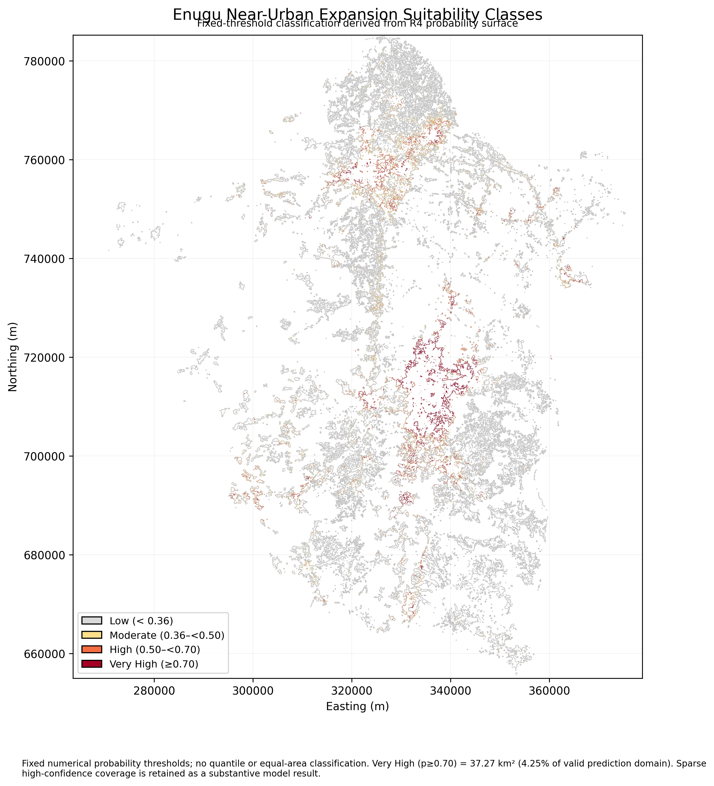
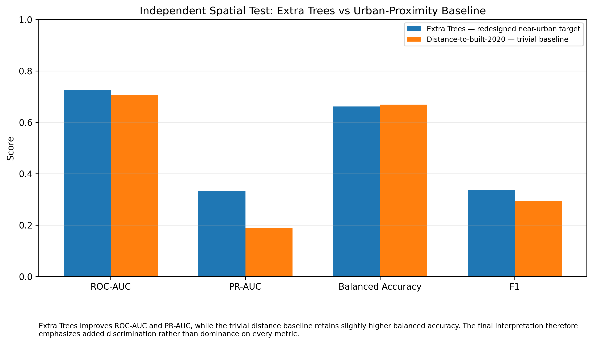
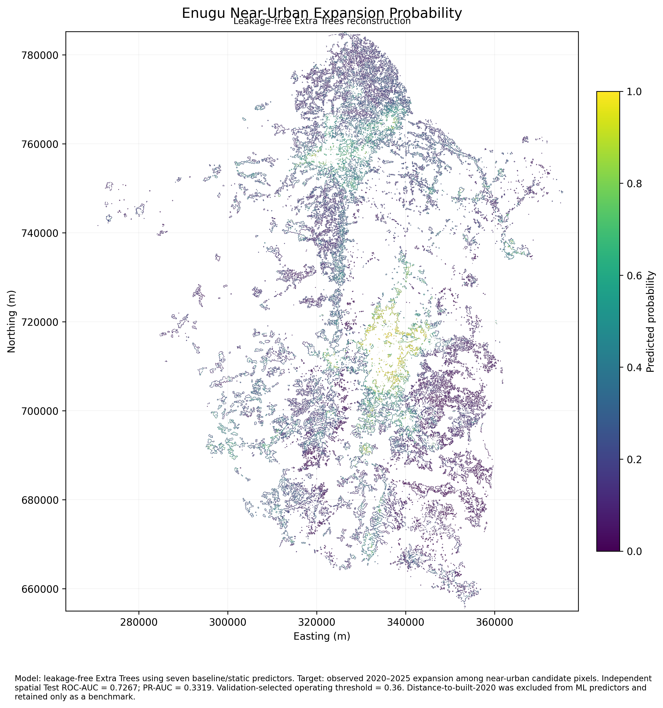
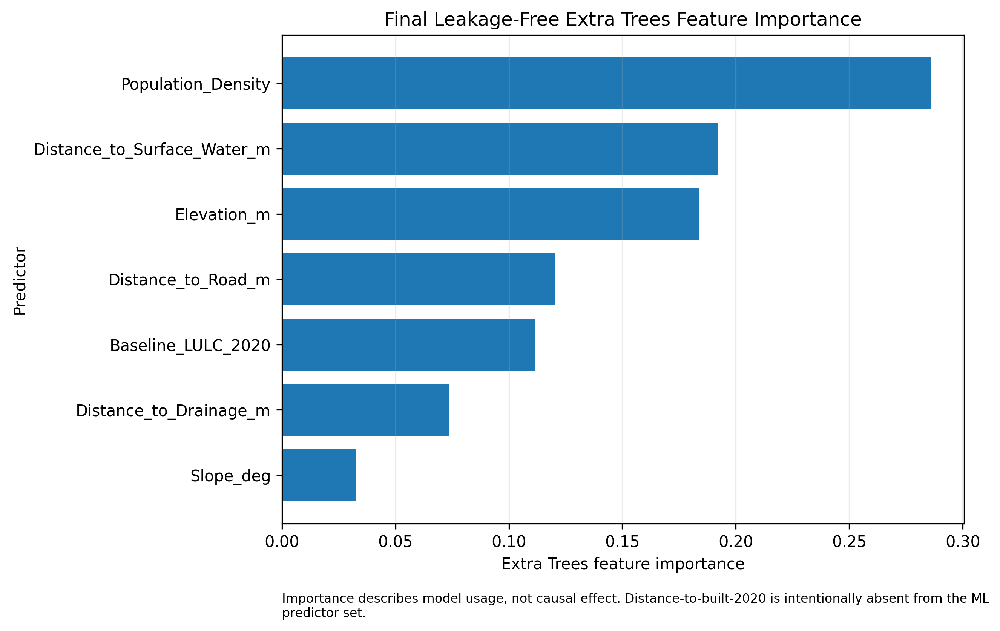
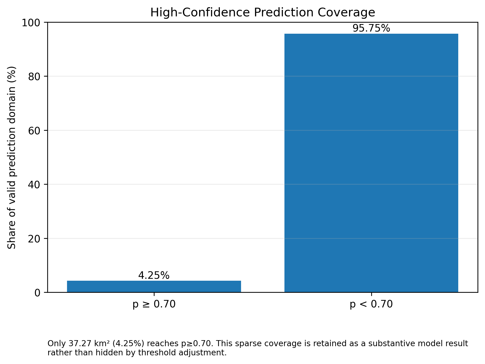
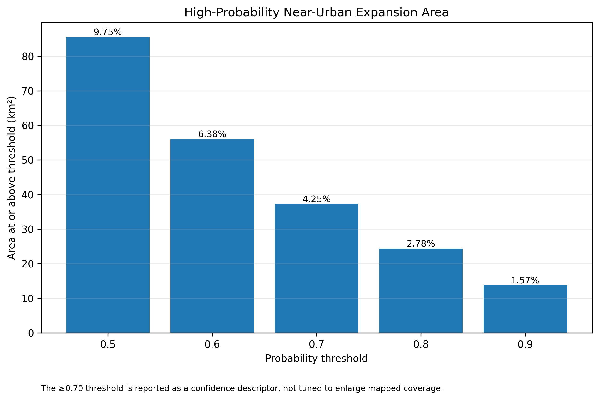

# Machine-Learning-Based Near-Urban Expansion Suitability — Enugu State, Nigeria

**A leakage-audited and spatially validated Extra Trees workflow for identifying near-urban locations associated with observed 2020–2025 expansion.**

<p align="center">
  
</p>

## Overview

This project evaluates whether terrain, accessibility, environmental conditions, population pressure and baseline land cover can help distinguish **observed urban expansion from stable non-built land within comparable near-urban locations in Enugu State**.

The modelling workflow was rebuilt after a forensic audit identified two problems in the earlier experiment: administrative/sample-construction variables could leak the target, and the original positive and negative samples occupied almost separate distance ranges relative to existing urban development. The corrected experiment removes those leakage pathways and evaluates the model using spatially separated Train, Validation and Test blocks.

**Research question:** Among pixels within the same 30–90 m near-urban support from 2020 built-up land, can baseline environmental and accessibility variables distinguish locations that transitioned from non-built to built-up by 2025?

## Final model

The final Extra Trees model uses seven leakage-safe predictors:

- Elevation
- Slope
- Distance to roads
- Distance to recurring surface water
- Distance to drainage
- 2020 population density
- Baseline 2020 land cover

`Distance_to_Built_2020_m` is **not** an ML predictor. It is retained only as a simple benchmark to test whether machine learning contributes information beyond urban proximity.

Coordinates, raster indices, spatial block IDs, sample IDs, component IDs and outcome-year predictors are also excluded from the model.

## Independent spatial validation

| Metric | Extra Trees | Distance-only baseline |
|---|---:|---:|
| ROC-AUC | **0.7267** | 0.7068 |
| PR-AUC | **0.3319** | 0.1903 |
| Balanced accuracy | 0.6614 | **0.6689** |
| F1 | **0.3368** | 0.2937 |

Extra Trees improves discrimination by approximately **+0.020 ROC-AUC** and **+0.142 PR-AUC** relative to simple proximity. The distance-only baseline retains slightly higher balanced accuracy, so the correct interpretation is that the ML model **adds predictive discrimination beyond proximity**, not that it outperforms the baseline on every metric.



## Probability and suitability results

The Validation-selected operating threshold is **0.36**. Final suitability classes use fixed numerical thresholds rather than quantiles:

| Class | Probability range | Area (km²) | Share of valid domain |
|---|---|---:|---:|
| Low | p < 0.36 | 715.13 | 81.53% |
| Moderate | 0.36 ≤ p < 0.50 | 76.49 | 8.72% |
| High | 0.50 ≤ p < 0.70 | 48.26 | 5.50% |
| Very High | p ≥ 0.70 | **37.27** | **4.25%** |

The **p ≥ 0.70 high-confidence area remains spatially sparse**. This is treated as a substantive model result rather than hidden by lowering the probability threshold.

### Final probability surface



### Final fixed-threshold suitability classes


## Predictor importance

Population density is the strongest model predictor, followed by distance to recurring surface water and elevation. Feature importance indicates model usage and predictive association; it should not be interpreted as causal effect.



## Model uncertainty and confidence

Only **37.27 km² (4.25%)** of the valid near-urban prediction domain reaches probability ≥0.70.





## Methodology

The corrected workflow:

1. Audited the original labels, predictors and validation records.
2. Identified administrative-variable leakage and distance-driven sample separation.
3. Reconstructed authoritative 2020→2025 label semantics.
4. Rebuilt the eligible modelling population.
5. Reconstructed the 2020 distance-to-built surface.
6. Redesigned the target as a fair near-urban transition problem using stable non-built controls within the same 30–90 m support as observed expansion.
7. Removed distance-to-built and all administrative/spatial-index fields from the ML predictor set.
8. Created spatially separated Train, Validation and Test blocks.
9. Compared Extra Trees against a trivial urban-proximity baseline.
10. Refit the locked model using Train + Validation after independent Test evaluation.
11. Generated the final probability surface and fixed-threshold suitability classes.
12. Quantified the high-confidence area rather than adjusting thresholds for visual appearance.

See [`docs/METHODOLOGY.md`](docs/METHODOLOGY.md).

## Planning interpretation

The final surface is best understood as **near-urban expansion suitability / probability under the reconstructed 2020–2025 experimental design**.

It is not a causal forecast, a statewide probability for every location, or a planning approval map. It should be combined with planning policy, infrastructure capacity, environmental assessment, land-tenure review and field verification.

## Repository structure

```text
.
├── assets/
│   ├── maps/
│   └── figures/
├── data/
│   ├── final/
│   └── tables/
├── docs/
├── reports/
├── validation/
├── CITATION.cff
├── README.md
├── RELEASE_NOTES.md
└── project.json
```

## Final technical report

- [`PDF report`](reports/Enugu_Final_Technical_Report.pdf)
- [`DOCX report`](reports/Enugu_Final_Technical_Report.docx)

## Author

**Abdullah Abdazeez Ayomide**  
Geo-spatial Planner | GIS & Remote Sensing Analyst | Environmental & Urban Planning Researcher

## Citation

Citation metadata is provided in [`CITATION.cff`](CITATION.cff).
